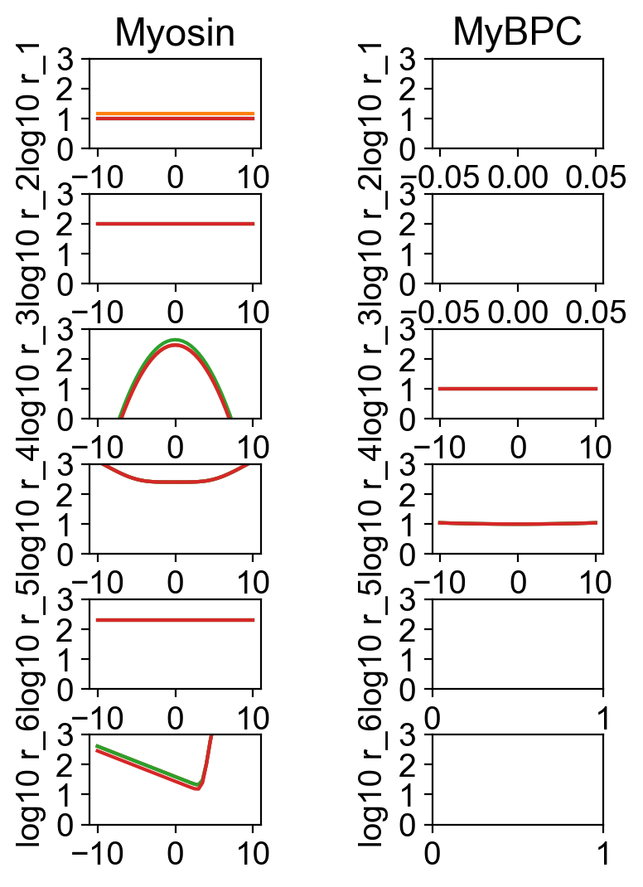
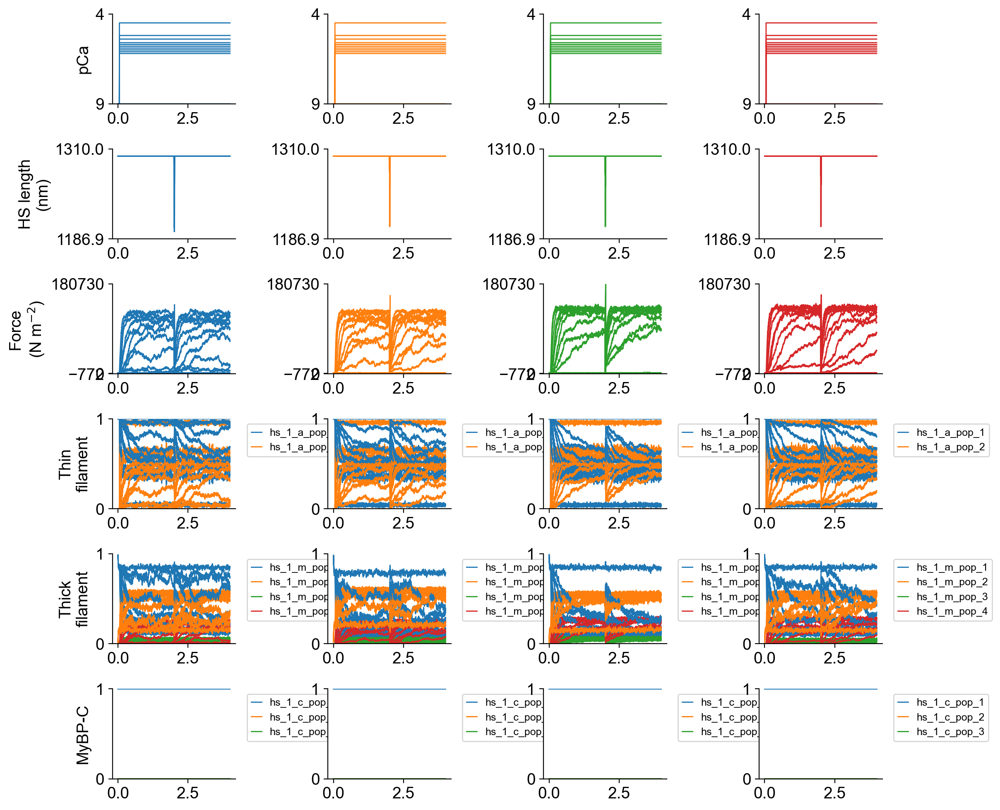
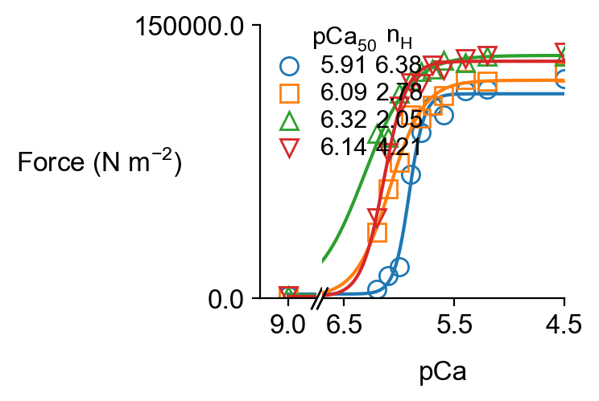
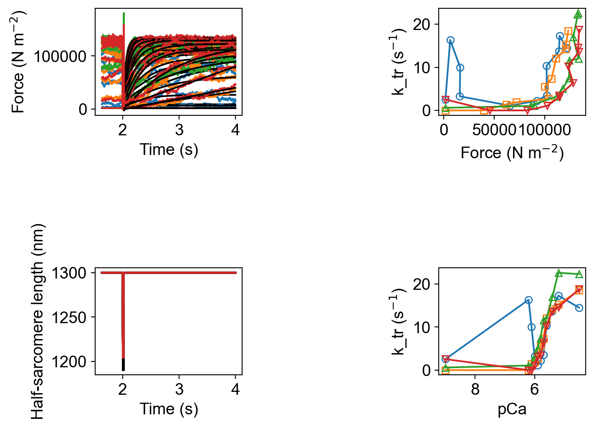
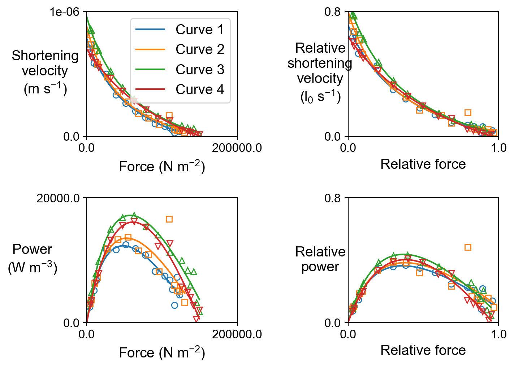

# RLC_fibersim_project
### Instructions

+ Pull latest version of [FiberSim](https://campbell-muscle-lab.github.io/FiberSim/)

+ Install FiberSim as described at [https://campbell-muscle-lab.github.io/FiberSim/pages/installation/installation.html](https://campbell-muscle-lab.github.io/FiberSim/pages/installation/installation.html)

+ Pull latest version of [project_greenberg_fibersim](https://github.com/Campbell-Muscle-Lab/project_greenberg_fibersim)

+ Open Anaconda prompt

+ Activate FiberSim environment
  + `conda activate fibersim`

+ Change directory to Fiberpy
  + `cd <FiberSim_Repo>/code/fiberpy/fiberpy`

+ Find the setup file in the project repo
  + `<project_repo>/base/setup.json`

+ Change the `FiberCpp_exe` path to match your FiberSim installation and resave

````
 "FiberSim_setup": {
        "FiberCpp_exe": {
            "relative_to": "False",
            "exe_file": "d:/ken/github/campbellmusclelab/models/FiberSim/bin/FiberCpp.exe"
        },
````

+ Type `python fiberpy.py chararacterize <project_repo>/base/setup.json`

+ Stuff should run

### Output

The setup file runs simulations for different myosin schemes for:
+ force-pCa and k_tr
+ force-velocity at pCa 4.5
  

There are 4 conditions:
+ 1 = base model
+ 2 = base model with faster SRX recrutment 
+ 3 = base model with faster myosin attachment in pre-power stroke.
+ 4 = base model with faster myosin detachement 

All the figures are in a folder structure under `<project_repo>/sim_data`

The rate diagram is



Summary files are as follows










### Setup file

The setup file uses features described in the [FiberSim demos](https://campbell-muscle-lab.github.io/FiberSim/pages/demos/demos.html) to run the different simulation conditions.

The cross-bridge scheme is adjusted using the [parameter adjustment mode](https://campbell-muscle-lab.github.io/FiberSim/pages/demos/model_comparison/parameter_adjustments/parameter_adjustments.html)

You can check this works by looking at the rate figure.

````
